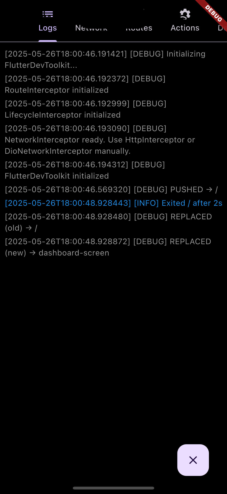
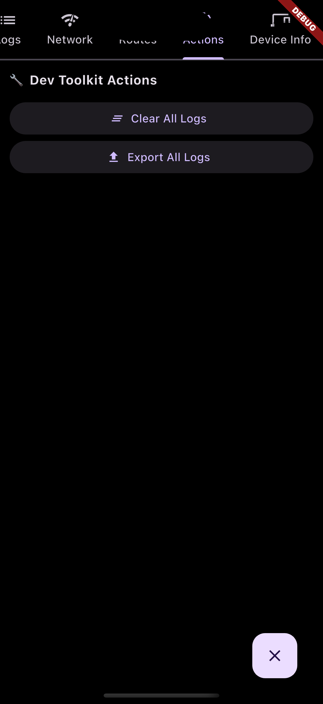
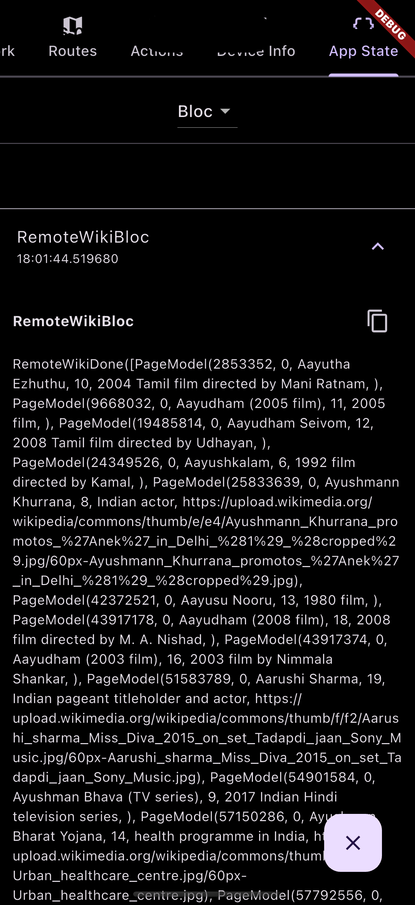
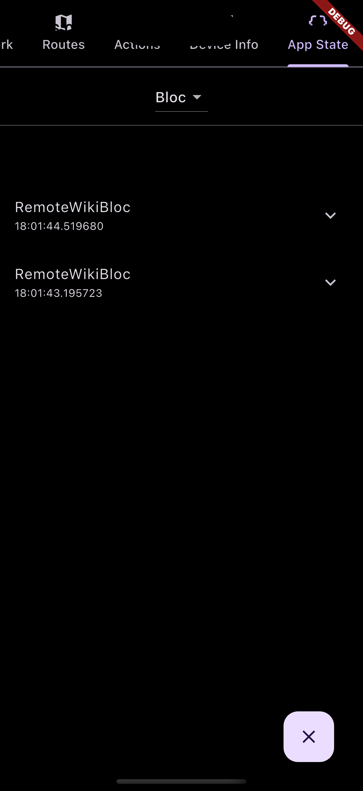
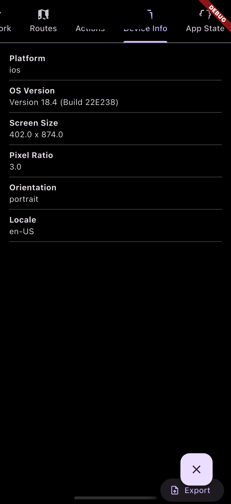
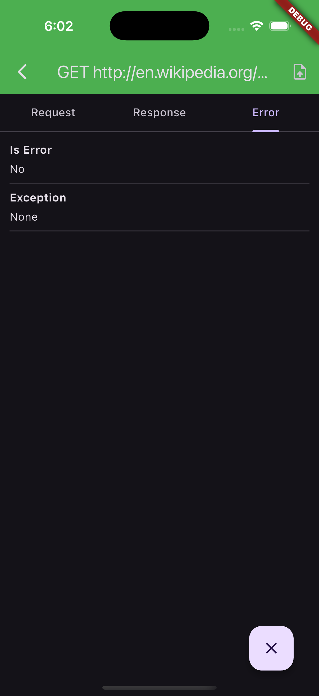
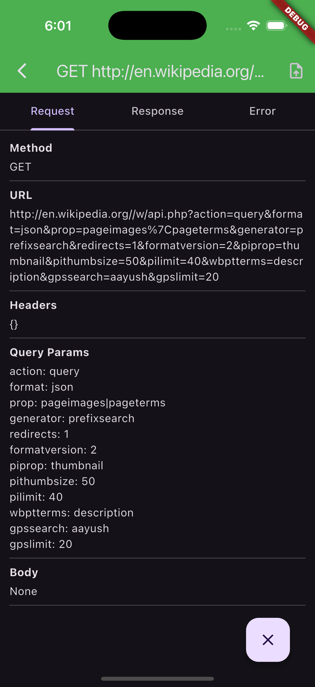
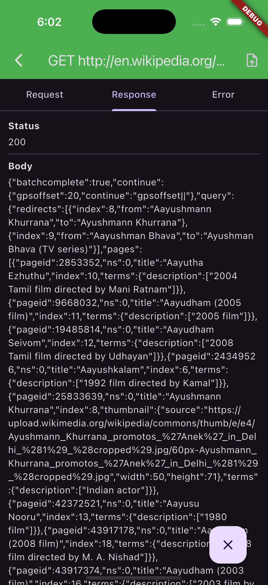
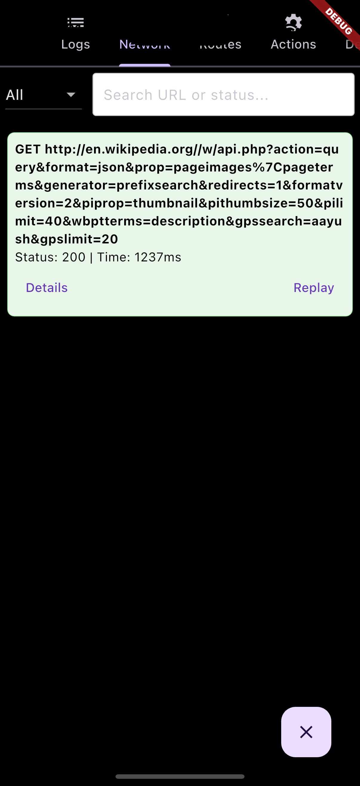

# Flutter Dev Toolkit

🚀 A modular in-app developer console for Flutter apps.

Track logs, API calls, navigation, performance, app state, and add your own plugins — all in real time, inside your app.

---

## ✨ Features

- ✅ In-app Dev Console
- ✅ Colored logs with filtering
- ✅ Network call inspector (`http`, `dio`, `retrofit`)
- ✅ Route stack and screen duration tracker
- ✅ Export logs
- ✅ Plugin system for custom tools
- ✅ App State Inspector (Bloc support)

---

## 🛠 Installation

Add to your `pubspec.yaml`:

```yaml
dependencies:
  flutter_dev_toolkit: ^latest_version
```

Then:

```bash
flutter pub get
```

---

## 🚀 Getting Started

### Initialize the toolkit in `main.dart`:

```dart
void main() {
  FlutterDevToolkit.init(
    config: DevToolkitConfig(
      disableBuiltInPlugins: [],
      logger: DefaultLogger(),
      enableRouteInterceptor: true,
      enableNetworkInterceptor: true,
      enableLifecycleInterceptor: true,
    ),
  );

  runApp(MyApp());
}
```

### Add the Dev Console to your widget tree:

```dart
MaterialApp(
  builder: (context, child) {
    return Stack(
      children: [
        child!,
        const DevOverlay(),
      ],
    );
  },
  home: const SplashScreen(),
  navigatorObservers: [RouteInterceptor.instance],
);
```

---

## 🧩 Plugins

You can add custom developer tools as plugins:

```dart
class CounterPlugin extends DevToolkitPlugin {
  @override 
  String get name => 'Counter';
  @override 
  IconData get icon => Icons.exposure_plus_1;

  @override 
  void onInit() {
    debugPrint('CounterPlugin loaded!');
  }

  @override 
  Widget buildTab(BuildContext context) => Center(child: Text('Counter Tab'));
}
```

Register it before `runApp`:

```dart
FlutterDevToolkit.registerPlugin(CounterPlugin());
```

---

### 🔍 App State Inspector (Built-in)

Inspect app-wide state transitions from supported frameworks.

#### ✅ Current Support:
- Bloc via `DevBlocObserver`

#### Usage:

```dart
// Add this line before initialising blocs
Bloc.observer = DevBlocObserver();

// Add this line after FlutterDevToolkit.init();
FlutterDevToolkit.registerPlugin(
  AppStateInspectorPlugin([
    BlocAdapter(), // built-in
  ]),
);
```

This shows:
- State source (Bloc type)
- Timestamp
- Copy to clipboard support

---

## 📤 Exporting

You can export logs and routes via the **Actions Tab**.

---

## 📝 Custom Logs

Log custom messages using:

```dart
FlutterDevToolkit.logger.log('Hello!');
FlutterDevToolkit.logger.log('Something went wrong', level: LogLevel.error);
```

---

## 🖼️ Screenshots

<h4>Log Console</h4>


<h4>Actions Tab</h4>


<h4>Bloc Inspector – Detail View</h4>


<h4>Bloc Inspector – Overview</h4>


<h4>Device Info</h4>


<h4>Network Error Detail</h4>


<h4>Network Request</h4>


<h4>Network Response</h4>


<h4>Network Interceptor</h4>


<h4>Route Tracker</h4>


---

## 📄 License

MIT
