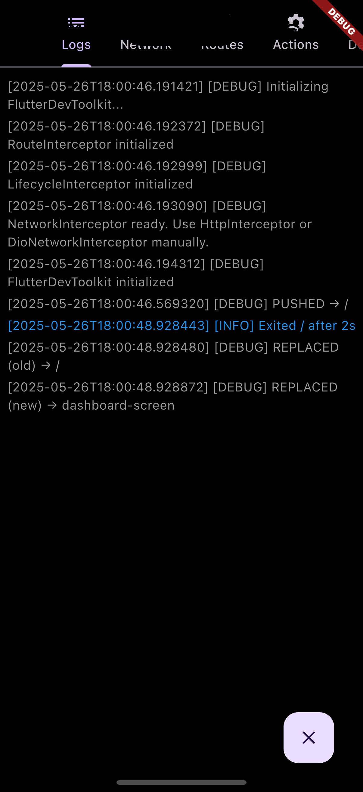
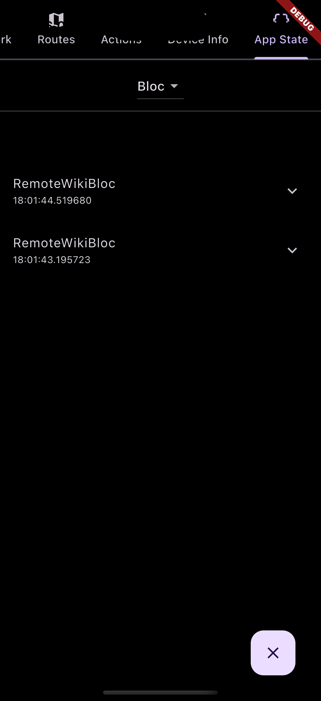
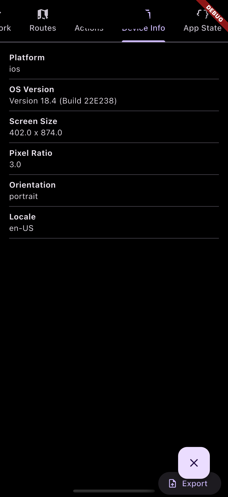
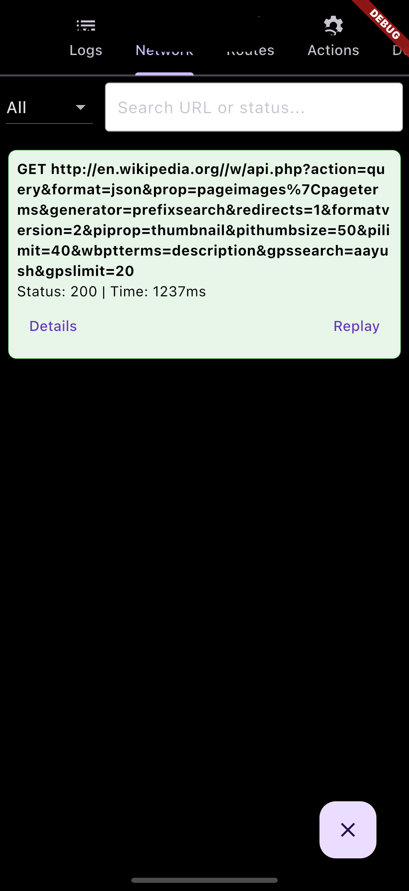
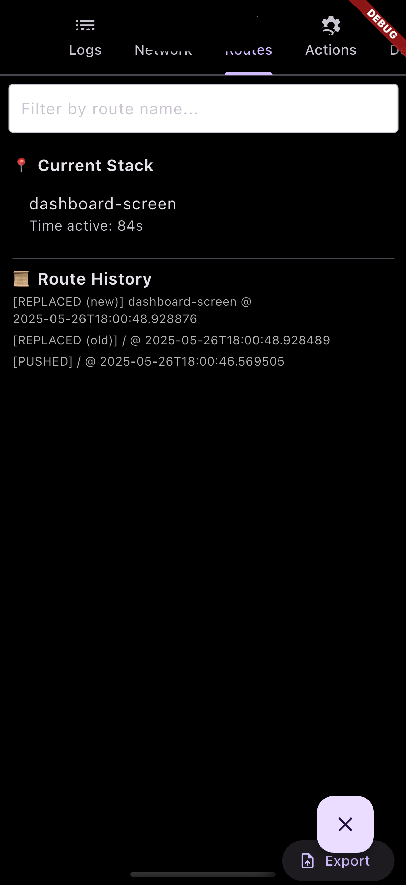

# Flutter Dev Toolkit

🚀 A modular in-app developer console for Flutter apps.

Track logs, API calls, navigation, lifecycle events, screen transitions, app state, and more — all in real time, inside your app.

[](https://pub.dev/packages/flutter_dev_toolkit)
[](https://github.com/aayushkedawat/flutter_dev_toolkit)

---

## ✨ Features

- ✅ In-app Dev Console with a draggable floating overlay
- ✅ Colored logs with filtering and tagging
- ✅ Network call inspector (supports `http`, `dio`, and `retrofit`)
- ✅ Route stack and screen duration tracker
- ✅ Search and filtering — by level and tag in logs, by method and status class in network
- ✅ Crash reporter — Flutter and unhandled async errors with stack traces
- ✅ Performance monitor — FPS, memory (RSS), startup time and jank frames
- ✅ Deep link inspector with query parameter breakdown
- ✅ Lifecycle event logging
- ✅ Device info panel
- ✅ Export logs, network calls (JSON, cURL, HAR 1.2) and route data
- ✅ Plugin system for adding custom tools
- ✅ App State Inspector (Bloc built in, Riverpod/Provider in a few lines)
- ✅ Light and dark console themes
- ✅ Suppressed in release builds by default

---

## 🛠 Installation

Add to your `pubspec.yaml`:

```yaml
dependencies:
  flutter_dev_toolkit: ^latest_version
```

Then:

```bash
flutter pub get
```

---

## 🚀 Getting Started

### 1. Initialize the toolkit

```dart
void main() {
  FlutterDevToolkit.init(
    config: DevToolkitConfig(
      logger: DefaultLogger(),

      // All built-in plugins are enabled by default. List the ones you want
      // to leave out:
      disableBuiltInPlugins: [
        // BuiltInPluginType.logs,
        // BuiltInPluginType.network,
        // BuiltInPluginType.routes,
        // BuiltInPluginType.deviceInfo,
        // BuiltInPluginType.crashes,
        // BuiltInPluginType.performance,
        // BuiltInPluginType.deepLinks,
      ],
    ),
  );

  runApp(MyApp());
}
```

`init()` installs `FlutterError.onError` and `PlatformDispatcher.onError`
handlers so the Crashes tab can record errors. If you install your own handler
afterwards, chain to the previous one — replacing it outright silently stops
crash capture:

```dart
final previousOnError = FlutterError.onError;
FlutterError.onError = (details) {
  myCrashReporter.record(details);
  previousOnError?.call(details);
};
```

### Configuration options

| Option | Default | Purpose |
|--------|---------|---------|
| `logger` | — | The `LoggerInterface` backing the Logs tab |
| `disableBuiltInPlugins` | `[]` | Built-in plugins to leave out |
| `enableInRelease` | `false` | Whether the overlay is active in release builds |
| `maxLogEntries` | `2000` | Log entries retained in memory |
| `maxNetworkLogs` | `500` | Network calls retained in memory |
| `logFrameDrops` | `false` | Also write every dropped frame to the Logs tab |
| `theme` | `DevConsoleTheme.dark` | Console's starting theme; toggleable at runtime |

### Release builds

The toolkit is suppressed in release builds unless you opt in with
`enableInRelease: true`. When suppressed, `DevOverlay` renders nothing and
`FlutterDevToolkit.logger` becomes a no-op, so your logging calls stay safe in
production.

### 2. Add Dev Console Overlay

```dart
MaterialApp(
  builder: (context, child) {
    return Stack(
      children: [
        child!,
        const DevOverlay(),
      ],
    );
  },
  navigatorObservers: [RouteInterceptor.instance],
);
```

---

## 🔌 Network Setup

### 🔹 Using `http` package

Replace the default client with HttpInterceptor from the toolkit:

```dart
import 'package:http/http.dart' as http;
import 'package:flutter_dev_toolkit/flutter_dev_toolkit.dart';

final client = HttpInterceptor(); // Instead of http.Client()

final response = await client.get(Uri.parse('https://example.com'));
```

### 🔹 Using `dio`

Register Dio interceptor:

```dart
final dio = Dio();
dio.interceptors.add(DioNetworkInterceptor());
```

### 🔹 Using `retrofit`

Pass the configured Dio instance to your Retrofit client:

```dart
final api = MyApiClient(Dio()..interceptors.add(DioNetworkInterceptor()));
```

---

## 🧩 Plugins

You can add custom developer tools as plugins:

```dart
class CounterPlugin extends DevToolkitPlugin {
  @override 
  String get name => 'Counter';

  @override 
  IconData get icon => Icons.exposure_plus_1;

  @override 
  void onInit() => debugPrint('CounterPlugin loaded!');

  @override 
  Widget buildTab(BuildContext context) => Center(child: Text('Counter Tab'));
}

FlutterDevToolkit.registerPlugin(CounterPlugin());
```

---

## 🔗 Deep Links

Deep link capture is routing-agnostic — call the observer wherever your app
receives a link:

```dart
// uni_links
uriLinkStream.listen((uri) {
  if (uri != null) {
    DevToolkitDeepLinkObserver.onLinkReceived(uri.toString());
  }
});

// go_router
GoRouter(
  redirect: (context, state) {
    DevToolkitDeepLinkObserver.onLinkReceived(
      state.uri.toString(),
      source: 'go_router',
    );
    return null;
  },
);
```

---

## 🔍 App State Inspector

Inspect state transitions, showing each change's previous and current value.

Bloc works out of the box, since the toolkit already depends on `bloc`:

```dart
Bloc.observer = DevBlocObserver();

FlutterDevToolkit.registerPlugin(
  AppStateInspectorPlugin([
    BlocAdapter(),
  ]),
);
```

### Other state frameworks

Rather than depend on every state library, the toolkit accepts changes pushed
in from your app through `RecordedStateAdapter`. Each framework is a few lines.

**Riverpod:**

```dart
final riverpodInspector = RecordedStateAdapter(name: 'Riverpod');

class DevToolkitProviderObserver extends ProviderObserver {
  @override
  void didUpdateProvider(provider, previousValue, newValue, container) {
    riverpodInspector.record(
      provider.name ?? provider.runtimeType.toString(),
      newValue,
      previous: previousValue,
    );
  }
}

runApp(
  ProviderScope(
    observers: [DevToolkitProviderObserver()],
    child: MyApp(),
  ),
);
```

**Provider / ChangeNotifier:**

```dart
final providerInspector = RecordedStateAdapter(name: 'Provider');

class CartModel extends ChangeNotifier {
  CartModel() {
    addListener(() => providerInspector.record('CartModel', items));
  }
}
```

Then register whichever adapters you use:

```dart
FlutterDevToolkit.registerPlugin(
  AppStateInspectorPlugin([BlocAdapter(), riverpodInspector]),
);
```

---

## 📝 Logging

```dart
FlutterDevToolkit.logger.log('Message');
FlutterDevToolkit.logger.log('Error occurred', level: LogLevel.error);
```

---

## 📤 Exporting

You can export relevant data directly from each plugin’s tab:

- Logs Plugin → Export filtered logs
- Network Plugin → Export captured network calls as JSON, or as a HAR 1.2
  archive you can open in Chrome DevTools, Postman or Charles Proxy
- Route Tracker → Export route stack and navigation history
- Crashes → Export captured errors with stack traces
- Deep Links → Export recorded links as JSON

---

## 🖼️ Screenshots

<h4>Log Console</h4>


<h4>Bloc Inspector – Overview</h4>


<h4>Device Info</h4>


<h4>Network Interceptor</h4>


<h4>Route Tracker</h4>


---

## 📄 License

MIT
