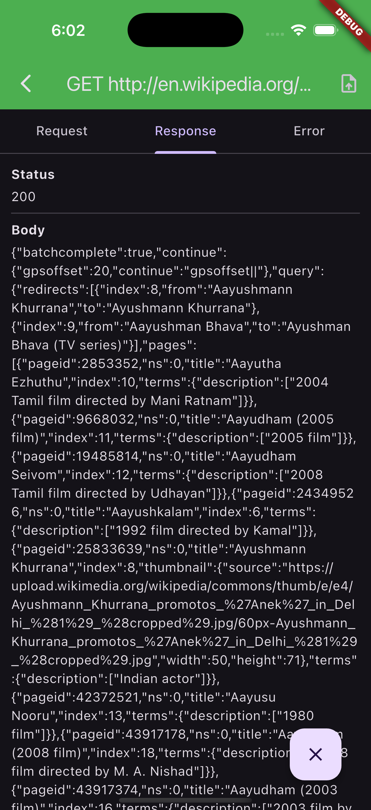

# Flutter Dev Toolkit

A modular in-app developer console for Flutter apps.

Track logs, API calls, crashes, navigation, performance, deep links, and more — all in real time, directly inside your running app.

[](https://pub.dev/packages/flutter_dev_toolkit)
[](https://github.com/aayushkedawat/flutter_dev_toolkit)

---

## Features

- **Collapsible side rail** — icon-only strip expands to labelled nav; scales to any number of plugins
- **Draggable overlay FAB** — drag to any screen position; red badge shows live error count
- **Logs** — colored severity levels, search, level filter, JSON export
- **Network inspector** — supports `http`, `dio`, and `retrofit`; replay requests; export as JSON or HAR
- **Response-time badges** — green < 200 ms · orange < 1 s · red ≥ 1 s per request
- **Crash capture** — automatic, zero-config; hooks `FlutterError.onError` and `PlatformDispatcher.onError`
- **Performance monitor** — live FPS, memory (RSS), and jank frame counter
- **Deep link inspector** — framework-agnostic; captures, parses, and inspects every incoming URI
- **Route tracker** — navigation stack and screen durations
- **Device info** — hardware and OS details
- **App State Inspector** — Bloc state transitions with full history
- **Plugin system** — extend with custom tabs; every panel is a plugin
- **Release safety** — overlay is suppressed in release builds by default (`enableInRelease: false`)

---

## Installation

```yaml
dependencies:
  flutter_dev_toolkit: ^1.4.0
```

```bash
flutter pub get
```

---

## Getting Started

### 1. Initialize

Call `FlutterDevToolkit.init` before `runApp`. The toolkit automatically installs crash handlers and lifecycle observers.

```dart
void main() {
  WidgetsFlutterBinding.ensureInitialized();

  FlutterDevToolkit.init(
    config: DevToolkitConfig(
      logger: DefaultLogger(),

      // Safety: overlay is hidden in release builds unless you opt in.
      enableInRelease: false,

      // Optional tuning
      maxLogEntries: 2000,
      maxNetworkLogs: 500,

      // Disable specific built-in panels if not needed
      disableBuiltInPlugins: [
        // BuiltInPluginType.performance,
        // BuiltInPluginType.deepLinks,
      ],
    ),
  );

  runApp(const MyApp());
}
```

### 2. Add the overlay

```dart
MaterialApp(
  navigatorObservers: [RouteInterceptor.instance],
  builder: (context, child) => Stack(
    children: [
      child!,
      const DevOverlay(),
    ],
  ),
);
```

The floating button appears in the corner. Drag it anywhere on screen. A red badge appears whenever an error is logged.

---

## Network Setup

### `http` package

```dart
import 'package:flutter_dev_toolkit/interceptors/network/http_interceptor.dart';

final client = HttpInterceptor(); // drop-in for http.Client()
final response = await client.get(Uri.parse('https://api.example.com/data'));
```

### `dio`

```dart
import 'package:flutter_dev_toolkit/interceptors/network/dio_interceptor.dart';

final dio = Dio();
dio.interceptors.add(DioNetworkInterceptor());
```

### Retrofit

Pass the configured Dio instance to your Retrofit client:

```dart
final api = MyApiClient(Dio()..interceptors.add(DioNetworkInterceptor()));
```

Network calls appear in the **Network** tab with method, URL, status code, and a color-coded response-time badge. Tap any entry for full request/response detail or to replay it.

#### Exporting network logs

The share button in the Network tab offers two formats:

- **JSON** — structured log of all captured requests
- **HAR** — HTTP Archive 1.2; open directly in Chrome DevTools, Postman, Charles Proxy, or Insomnia

---

## Crash Capture

No setup required. Once `FlutterDevToolkit.init` is called, all Flutter framework errors and unhandled async exceptions are captured automatically and shown in the **Crashes** tab with full stack traces.

```dart
// The toolkit handles these automatically — no manual wiring needed:
// FlutterError.onError → captured as non-fatal
// PlatformDispatcher.instance.onError → captured as fatal
```

Crashes are also reflected in the FAB error badge so you notice them without opening the console.

---

## Performance Monitor

The **Performance** tab shows live metrics with no extra setup:

| Metric | Source | Thresholds |
|--------|--------|------------|
| FPS | `SchedulerBinding` frame callbacks | ≥55 green · ≥30 orange · <30 red |
| Memory | `ProcessInfo.currentRss` | <150 MB green · <300 MB orange · ≥300 MB red |
| Jank frames | `SchedulerBinding.addTimingsCallback` | Frames where build + raster > 16 ms |

---

## Deep Link Inspector

Use `DevToolkitDeepLinkObserver.onLinkReceived` anywhere you handle incoming URIs. The inspector parses the URI and displays scheme, host, path, fragment, and query parameters.

### With `go_router`

```dart
GoRouter(
  redirect: (context, state) {
    DevToolkitDeepLinkObserver.onLinkReceived(
      state.uri.toString(),
      source: 'go_router',
    );
    return null;
  },
)
```

### With `uni_links`

```dart
uriLinkStream.listen((uri) {
  if (uri != null) {
    DevToolkitDeepLinkObserver.onLinkReceived(
      uri.toString(),
      source: 'uni_links',
    );
  }
});
```

### Manual / testing

```dart
DevToolkitDeepLinkObserver.onLinkReceived(
  'myapp://product/42?ref=banner',
  source: 'manual',
);
```

---

## App State Inspector

Inspect Bloc state transitions in real time.

```dart
Bloc.observer = DevBlocObserver();

FlutterDevToolkit.registerPlugin(
  AppStateInspectorPlugin([BlocAdapter()]),
);
```

---

## Custom Plugins

Any panel can be added as a plugin by extending `DevToolkitPlugin`:

```dart
class FeatureFlagsPlugin extends DevToolkitPlugin {
  @override
  String get name => 'Flags';

  @override
  IconData get icon => Icons.flag_outlined;

  @override
  void onInit() {}

  @override
  Widget buildTab(BuildContext context) {
    return ListView(
      children: myFlags.entries
          .map((e) => SwitchListTile(
                title: Text(e.key),
                value: e.value,
                onChanged: (v) => myFlags[e.key] = v,
              ))
          .toList(),
    );
  }
}

// Register after init:
FlutterDevToolkit.registerPlugin(FeatureFlagsPlugin());
```

Custom plugins appear in the side rail alongside the built-in panels.

---

## Logging

```dart
FlutterDevToolkit.logger.log('Server responded');
FlutterDevToolkit.logger.log('Cache miss', level: LogLevel.warning);
FlutterDevToolkit.logger.log('Payment failed', level: LogLevel.error);
```

---

## Release Safety

By default `enableInRelease: false` — the overlay widget renders nothing in release builds and no observers or interceptors are registered. Set to `true` only if you intentionally ship the console to production (e.g. internal beta builds).

```dart
FlutterDevToolkit.init(
  config: DevToolkitConfig(
    logger: DefaultLogger(),
    enableInRelease: false, // default — safe to ship
  ),
);
```

---

## Screenshots

<h4>Log Console</h4>


<h4>Network Inspector</h4>


<h4>Network Call Detail</h4>


<h4>Route Tracker</h4>


<h4>Bloc State Inspector</h4>


<h4>Device Info</h4>


---

## License

MIT
