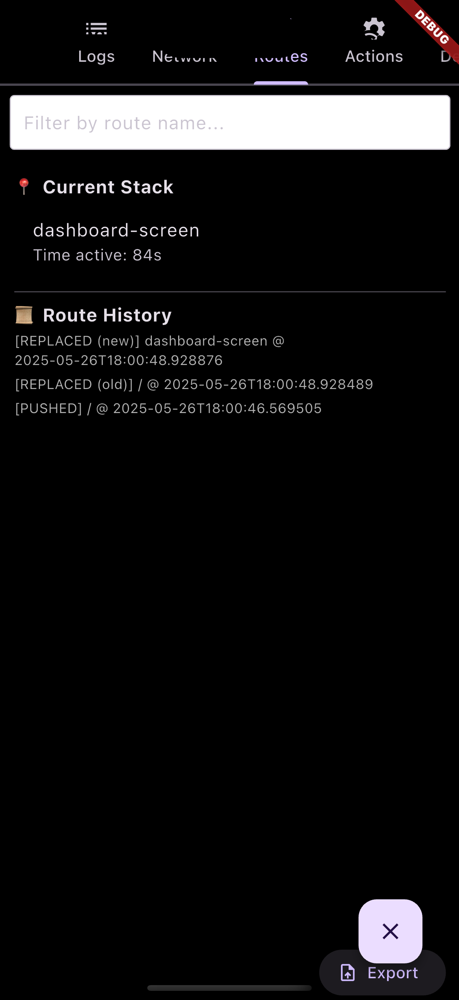

# Flutter Dev Toolkit

🚀 A modular in-app developer console for Flutter apps.

Track logs, API calls, navigation, lifecycle events, screen transitions, app state, and more — all in real time, inside your app.

[](https://pub.dev/packages/flutter_dev_toolkit)
[](https://github.com/aayushkedawat/flutter_dev_toolkit)

---

## ✨ Features

- ✅ In-app Dev Console with floating overlay
- ✅ Colored logs with filtering and tagging
- ✅ Network call inspector (supports `http`, `dio`, and `retrofit`)
- ✅ Route stack and screen duration tracker
- ✅ Lifecycle event logging
- ✅ Export logs, network calls, and route data
- ✅ Plugin system for adding custom tools
- ✅ App State Inspector (Bloc support)

---

## 🛠 Installation

Add to your `pubspec.yaml`:

```yaml
dependencies:
  flutter_dev_toolkit: ^latest_version
```

Then:

```bash
flutter pub get
```

---

## 🚀 Getting Started

### 1. Initialize the toolkit

```dart
void main() {
  FlutterDevToolkit.init(
    config: DevToolkitConfig(
      logger: DefaultLogger(),
      disableBuiltInPlugins: [
        // BuiltInPluginType.logs,
        // BuiltInPluginType.network,
        // BuiltInPluginType.routes,
        // BuiltInPluginType.deviceInfo,
      ],
    ),
  );

  runApp(MyApp());
}
```

### 2. Add Dev Console Overlay

```dart
MaterialApp(
  builder: (context, child) {
    return Stack(
      children: [
        child!,
        const DevOverlay(),
      ],
    );
  },
  navigatorObservers: [RouteInterceptor.instance],
);
```

---

## 🔌 Network Setup

### 🔹 Using `http` package

Replace the default client with HttpInterceptor from the toolkit:

```dart
import 'package:http/http.dart' as http;
import 'package:flutter_dev_toolkit/flutter_dev_toolkit.dart';

final client = HttpInterceptor(); // Instead of http.Client()

final response = await client.get(Uri.parse('https://example.com'));
```

### 🔹 Using `dio`

Register Dio interceptor:

```dart
final dio = Dio();
dio.interceptors.add(DioNetworkInterceptor());
```

### 🔹 Using `retrofit`

Pass the configured Dio instance to your Retrofit client:

```dart
final api = MyApiClient(Dio()..interceptors.add(DioNetworkInterceptor()));
```

---

## 🧩 Plugins

You can add custom developer tools as plugins:

```dart
class CounterPlugin extends DevToolkitPlugin {
  @override 
  String get name => 'Counter';

  @override 
  IconData get icon => Icons.exposure_plus_1;

  @override 
  void onInit() => debugPrint('CounterPlugin loaded!');

  @override 
  Widget buildTab(BuildContext context) => Center(child: Text('Counter Tab'));
}

FlutterDevToolkit.registerPlugin(CounterPlugin());
```

---

## 🔍 App State Inspector

Inspect state transitions (Bloc only for now).

```dart
Bloc.observer = DevBlocObserver();

FlutterDevToolkit.registerPlugin(
  AppStateInspectorPlugin([
    BlocAdapter(),
  ]),
);
```

---

## 📝 Logging

```dart
FlutterDevToolkit.logger.log('Message');
FlutterDevToolkit.logger.log('Error occurred', level: LogLevel.error);
```

---

## 📤 Exporting

You can export relevant data directly from each plugin’s tab:

- Logs Plugin → Export filtered logs
- Network Plugin → Export captured network calls
- Route Tracker → Export route stack and navigation history

---

## 🖼️ Screenshots

<h4>Log Console</h4>


<h4>Bloc Inspector – Overview</h4>


<h4>Device Info</h4>


<h4>Network Interceptor</h4>


<h4>Route Tracker</h4>


---

## 📄 License

MIT
